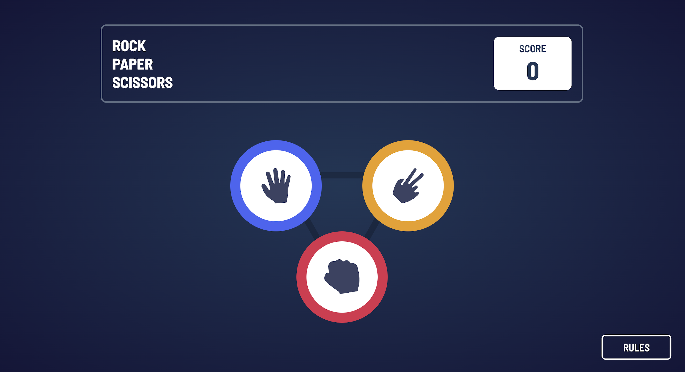

# Frontend Mentor - Rock, Paper, Scissors solution

This is a solution to the [Rock, Paper, Scissors challenge on Frontend Mentor](https://www.frontendmentor.io/challenges/rock-paper-scissors-game-pTgwgvgH). Frontend Mentor challenges help you improve your coding skills by building realistic projects.

## Table of contents

- [Overview](#overview)
    - [The challenge](#the-challenge)
    - [Screenshot](#screenshot)
    - [Links](#links)
- [My process](#my-process)
    - [Built with](#built-with)
    - [What I learned](#what-i-learned)
- [Author](#author)

## Overview

### The challenge

Users should be able to:

- View the optimal layout for the game depending on their device's screen size
- Play Rock, Paper, Scissors against the computer
- Maintain the state of the score after refreshing the browser _(optional)_
- **Bonus**: Play Rock, Paper, Scissors, Lizard, Spock against the computer _(optional)_

### Screenshot

### Links

- Live Site URL: [Rock-Papers-Scissors](https://andrejm97.github.io/Projects/rock-paper-scissors-master/)

## My process

### Built with

- Semantic HTML5 markup
- CSS custom properties
- Flexbox
- Javascript

### What I learned

HTML Structure: Organized elements efficiently for the game interface, including score displays and modal windows.

CSS Styling: Utilized flexbox layout, CSS variables, and background images for visual enhancement.

JavaScript Functionality: Implemented game logic for user interactions, such as determining the winner and updating scores dynamically.

Responsive Design: Ensured adaptability across devices using media queries to adjust layout and font sizes.

Modal Windows: Implemented modal windows for displaying game rules, toggling visibility with JavaScript.

## Author
- Frontend Mentor - [@AndrejM97](https://www.frontendmentor.io/profile/AndrejM97)

